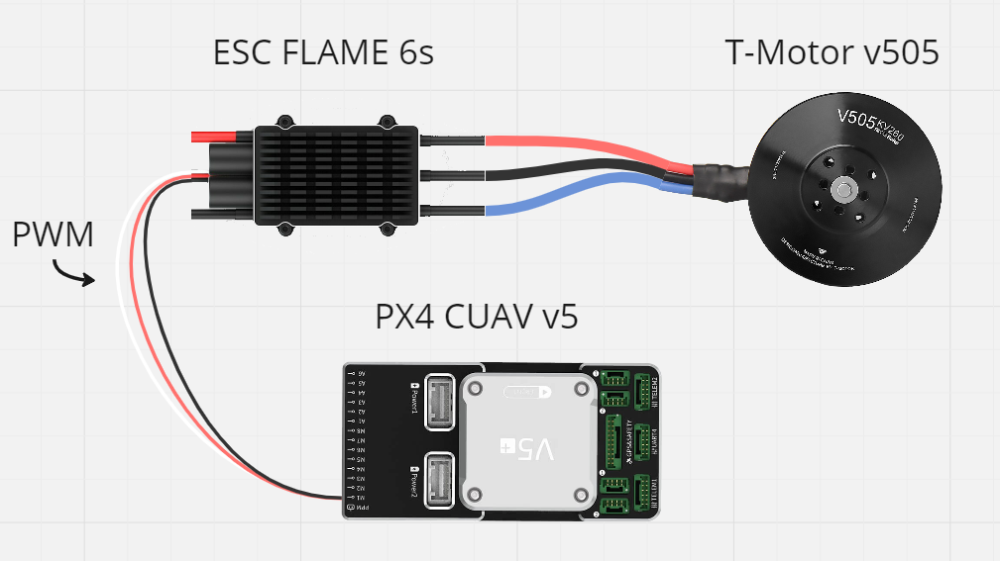
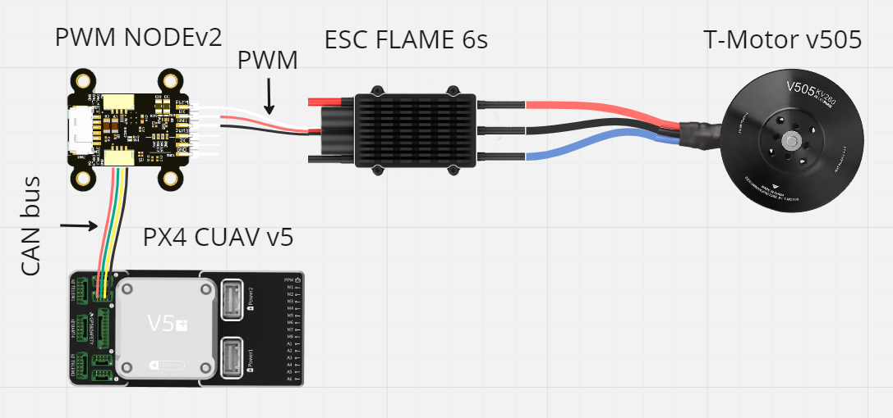
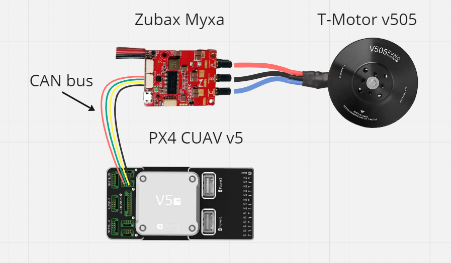

# Purpose of the drone
## Motivation
Modern drones are designed to control the motors via PWM. This method is easy to implement as most autopilots have PWM outputs and most ESCs require PWM for control. However, it is a poor approach for controlling drones. PWM signals are vulnerable to distortion from strong electromagnetic fields and do not use data integrity checking or redundancy. This leads to reduced feedback quality in the Kalman filter. To avoid this it is suggested to use a digital CAN bus.

## Suggestion 
Replacing the control signal with a CAN bus will increase the stability of the system. To test the Cyphal and DroneCAN protocols, a drone design was developed. To perform the tests, the drone design is changed according to the following list:

 - [x] PWM flights. Autopilot cables go directly from the autopilot to the ESC.
 - [x] DroneCAN flights. CAN cables go from the autopilot to the [PWM Node](https://raccoonlab.co/tproduct/360882105-449815179261-cyphal-and-dronecan-pwm-node-v2), and then PWM cables go to the ESC
 - [x] Cyphal flights. CAN cables go from the autopilot to the [PWM Node](https://raccoonlab.co/tproduct/360882105-449815179261-cyphal-and-dronecan-pwm-node-v2), and then PWM cables go to the ESC
 - [ ] Cyphal flights. CAN cables go from the autopilot to [Myxa](https://zubax.com/products/myxa)

## Results

### PWM

The connection via PWM was the first one. The wiring diagram is shown below:

Flight: [video](https://www.youtube.com/watch?v=bF6pm1bQ9Ks) | [log](https://review.px4.io/plot_app?log=15b0ad61-4d66-4981-8859-f853cad3dc1c)

Flight: [log](https://review.px4.io/plot_app?log=9a09421f-5872-44e7-a61a-f9717f8e9e5b)

### DroneCAN
Diagram:

Flight: [video](https://youtu.be/0hR0CX1QG-s) | [log](https://review.px4.io/plot_app?log=4a3cf87a-0712-4381-9e35-fb9721ceb05d)

Flight: [video](https://youtu.be/-_-Hau36b2o?si=XCnLyRr9R_jYNAQt) | [log](https://review.px4.io/plot_app?log=1a95ffb9-f365-4d48-9dae-9e10be2324c9)

Flight: [video](https://youtu.be/I_uR951W_0I) | [log](https://review.px4.io/plot_app?log=267315de-17ea-458a-a083-d736de84dffb)

### Cyphal on PWM Node v2
Diagram:

Flight: [video](https://youtu.be/DMQ_uFp9GC8) | [log](https://review.px4.io/plot_app?log=50bcc929-d9f1-4c23-8f3b-0aff1351e8ce)

Flight: [video](https://youtu.be/HDFo5cQEWIE) | [log](https://review.px4.io/plot_app?log=9430bbb8-d338-49f2-aeb1-94bf418a2b03)

### Cyphal on Myxa
Diagram:

**work in progress**
